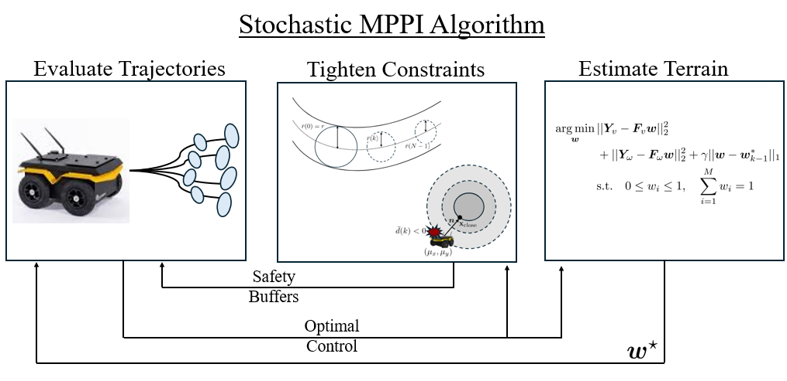
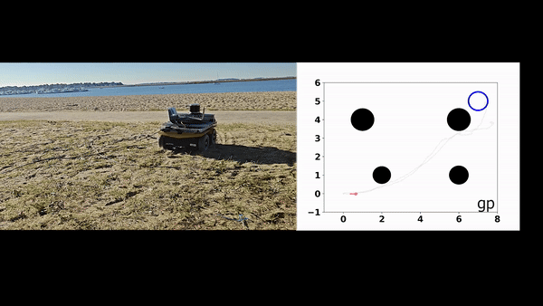
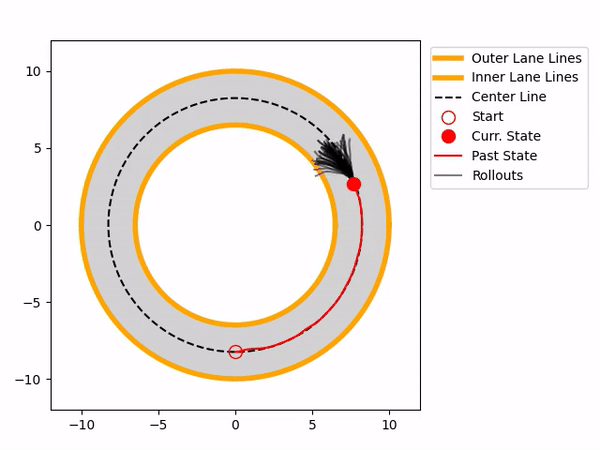
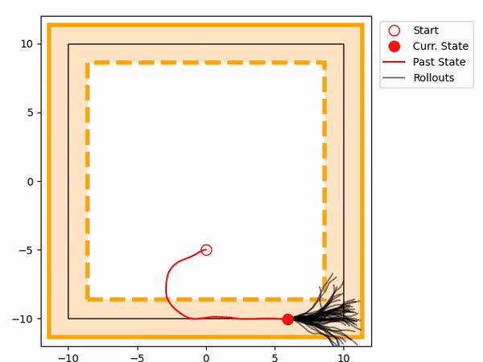
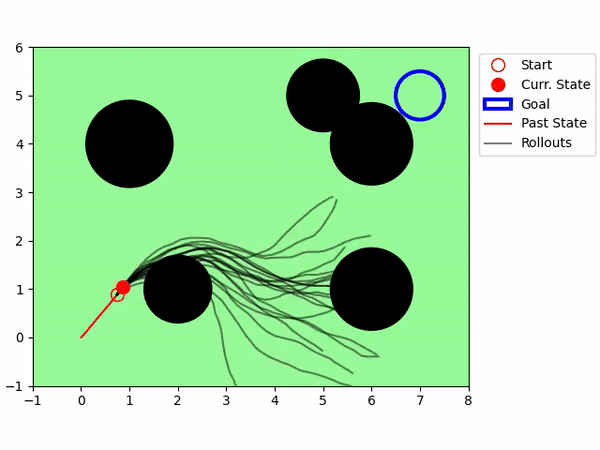

# Stochastic-MPPI
This repository provides the implementation of a Chance-Constrained Model Predictive Path Integral (MPPI) Control method for skid-steer mobile robot navigation in outdoor environments. The robot’s dynamics are modeled as a combination of a nominal physics-based model and corrections derived from Gaussian Process (GP) regression, which is trained for various outdoor terrains. The GP mean predictions are integrated into the dynamics, while the GP variance predictions are utilized to tighten safety constraints for obstacle avoidance and path tracking.

The GP regression is trained using Batch GP Regression from the [GPyTorch](https://docs.gpytorch.ai/en/stable/examples/08_Advanced_Usage/Simple_Batch_Mode_GP_Regression.html) library. For each candidate MPPI control rollout executed on the GPU, both the GP mean and variance predictions are evaluated on the GPU, ensuring computational efficiency. The proposed uncertainty-aware planning algorithm has been benchmarked against traditional MPPI approaches using a data-driven kinematic model (EDD5) and a unicycle kinematic model. The open-source MPPI implementation from [this](https://arxiv.org/abs/2311.06234) paper was used as the baseline for our implementation. 
The proposed algorithm was evaluated on a Lenovo Legion 5 Pro laptop equipped with an Intel i7-12700H processor (14 cores, 2.3 GHz base clock), 32 GB RAM, 1 TB SSD, and an NVIDIA RTX 3070 Ti (Mobile) GPU. Additional details can be found at the project [website](https://stochasticmppi.github.io/)

## Video
For an overview of our method and results, please check out the supplementary video.
<p align="center">
    <a href="https://youtu.be/phzo_e5jMTU?si=IBEhybAJfjNi_pV4"></a>
</p>

## Experiments
<!-- First row of images -->
<div style="text-align: center;">
  
  
  
</div>

<!-- Second row of images -->
<div style="text-align: center; margin-top: 10px;">
  
  
  
</div>


## Simulation Setup
Begin by creating a Python virtual environment and installing dependencies:

```bash
git clone git@github.com:RIVeR-Lab/Stochastic-MPPI.git
cd Stochastic-MPPI
sudo apt install python3.10-venv  # Install Python virtual environment package if not already installed
python3 -m venv stochastic_mppi_venv  # Create a virtual environment
source stochastic_mppi_venv/bin/activate  # Activate the virtual environment
pip install -r requirements.txt  # Install dependencies from the requirements file
```

All the MPPI implementations share the same configuration parameters, which can be found in the file ```configurations.py```. There are three main experiments: circular path tracking, square path tracking, and obstacle avoidance at high speeds. To switch between planners, modify the ```planner_model``` parameter in the ```Config``` class within ```configurations.py```.

The pre-trained GP and kinematic models for three different terrains—Asphalt, Grass, and Tile—can be found in the ```models``` folder, along with the trained neural network for ground truth motion estimation. We utilized the off-road dataset from [this]((https://ieeexplore.ieee.org/abstract/document/8794216?casa_token=o5L0UtPMY2cAAAAA:2X7yFItp3WNb_tsVqFRhSf0CdQy0Vir10yPHWVDxRs52b6l3mHKBK-QTiDSadfI-7hjLLv_TObg8)) paper to train these models. The three algorithms can be run as follows from the command line:
```bash
# Run square path tracking experiment
python3 src/square_path_tracking.py

# Run circular path tracking experiment
python3 src/circular_path_tracking.py

# Run obstacle avoidance at high speeds experiment
python3 src/obstacle_avoidance.py
```

## Citation
If you find this code useful, please consider citing our papers:

```bibtex
@article{trivedi2024data,
  title={Data-Driven Sampling Based Stochastic MPC for Skid-Steer Mobile Robot Navigation},
  author={Trivedi, Ananya and Prajapati, Sarvesh and Shirgaonkar, Anway and Zolotas, Mark and Padir, Taskin},
  journal={arXiv preprint arXiv:2411.03289},
  year={2024}
}

@inproceedings{trivedi2024probabilistic,
  title={A probabilistic motion model for skid-steer wheeled mobile robot navigation on off-road terrains},
  author={Trivedi, Ananya and Zolotas, Mark and Abbas, Adeeb and Prajapati, Sarvesh and Bazzi, Salah and Pad{\i}r, Ta{\c{s}}kin},
  booktitle={2024 IEEE International Conference on Robotics and Automation (ICRA)},
  pages={12599--12605},
  year={2024},
  organization={IEEE}
}

@inproceedings{trivedi2023probabilistic,
  title={Probabilistic Dynamic Modeling and Control for Skid-Steered Mobile Robots in Off-Road Environments},
  author={Trivedi, Ananya and Bazzi, Salah and Zolotas, Mark and Pad{\i}r, Ta{\c{s}}k{\i}n},
  booktitle={2023 IEEE International Conference on Assured Autonomy (ICAA)},
  pages={57--60},
  year={2023},
  organization={IEEE}
}
```
